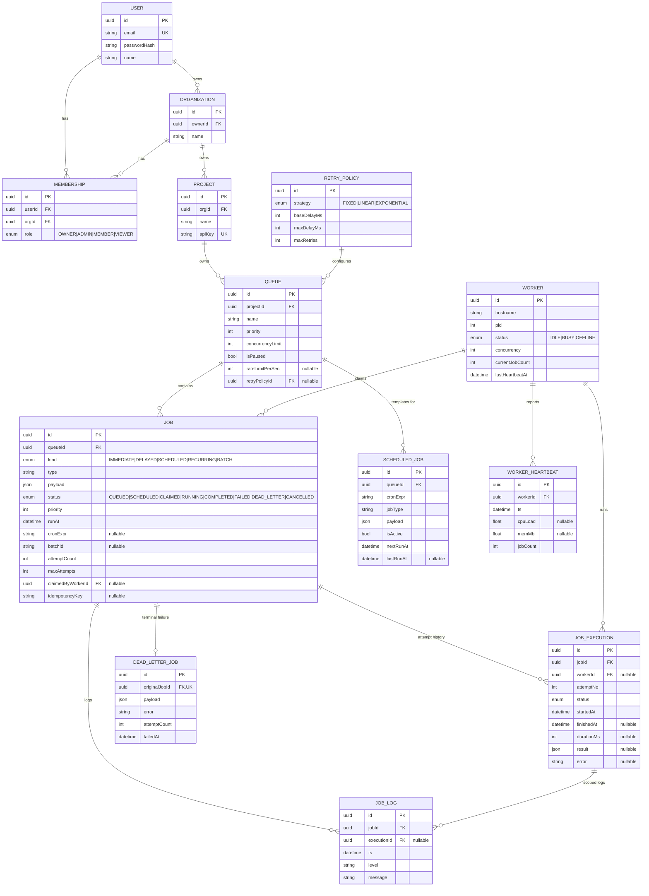

# Database Design

Full source of truth: [`packages/shared/prisma/schema.prisma`](../packages/shared/prisma/schema.prisma).
This document explains the *why* behind it.

## Entity-relationship diagram



## Design rationale

### Primary keys
Every table uses a UUID primary key (`@default(uuid())`) rather than a serial integer.
Job IDs are handed back to API clients and embedded in idempotency checks, worker claim
logs, and websocket events across service boundaries — UUIDs avoid leaking a
row-count/growth-rate signal and don't require a round trip to a single sequence
generator, which matters once you have multiple API instances inserting concurrently.

### Foreign keys and cascade behavior
- `Organization.ownerId → User`, `Membership → User/Organization`, `Project → Organization`,
  `Queue → Project`, `Job → Queue`, `JobExecution/JobLog → Job`: all **cascade on delete**.
  Deleting a project should not leave orphaned queues, jobs, or execution history behind —
  there's no legitimate reason to keep a `Job` row whose `Queue` no longer exists.
- `Job.claimedByWorkerId → Worker`: **no cascade** (left as a nullable FK with default
  restrict behavior). A worker process is ephemeral infrastructure; if it's decommissioned,
  the historical fact "this worker executed this job" should survive for audit purposes even
  after the `Worker` row is eventually pruned. In practice we don't currently prune `Worker`
  rows, but the schema doesn't assume we never will.
- `DeadLetterJob.originalJobId → Job`: cascades, and is `@unique` — a job can have at most
  one dead-letter record (retrying a dead-lettered job deletes it; see below), enforced at
  the database level rather than trusted to application logic alone.

### Normalization
`Job` holds only *current* state (status, attempt count, timestamps for the current/last
attempt). Retry history is **not** stored by overwriting the `Job` row on each attempt —
it's appended as a new `JobExecution` row per attempt (3NF: execution-specific facts like
"how long did attempt 2 take" belong to the execution, not the job). This means:
- The `Job` row answers "what's happening right now" in O(1).
- `JobExecution` answers "what happened on every attempt" without any data loss, and is the
  audit trail the assignment asks for ("retry history... for every job").
- `JobLog` is further split out from `JobExecution` because a job can have many log lines
  per execution (a one-to-many that would otherwise force `JobExecution` into either an
  unbounded text blob or repeating groups — a normalization violation).

`RetryPolicy` is its own table, referenced by `Queue.retryPolicyId`, rather than four
columns inlined onto `Queue`. Multiple queues commonly want to share one policy ("all
low-priority background queues use fixed 30s retries") — normalizing it out avoids
duplicating the same four values across every queue row and makes changing a shared policy
a single-row update.

### Indexes
The single most important index in the schema is the composite one backing the claim
query:

```prisma
@@index([queueId, status, priority, runAt])
```

Every claim attempt filters by `queue_id IN (...) AND status IN ('QUEUED','SCHEDULED') AND
run_at <= now()`, then orders by `priority DESC, run_at ASC`. Without this composite index,
that query degrades to a sequential scan across the entire `jobs` table on every single
poll tick from every worker — the exact hot path that needs to stay O(log n). A secondary
`@@index([status, runAt])` supports admin/dashboard queries that scan across queues (e.g.
"how many jobs are currently RUNNING system-wide").

`@@index([batchId])` supports "show me all jobs in this batch." `@@unique([queueId,
idempotencyKey])` both enforces the idempotent-submission guarantee and doubles as an
index for the (rare) lookup by idempotency key.

`WorkerHeartbeat` and `JobLog` both index `(parentId, timestamp)` since their only real
query pattern is "most recent N rows for this parent, in order" — a time-series access
pattern that benefits from the timestamp being the second column in the composite index
(first column narrows to the parent, second gives the ordering the index already provides
for free).

### Why `ScheduledJob` and `DeadLetterJob` are separate tables, not status flags
Both could theoretically be modeled as extra columns/statuses on `Job`. They're pulled out
because they have a genuinely different access pattern and lifecycle:
- A recurring job's *template* (cron expression, next run time) persists indefinitely and
  is edited independently of any single materialized run. Folding that into `Job` would
  mean every recurring job either duplicates the cron expression on every materialized row,
  or `Job` needs a nullable self-reference back to "the template," which is more complex
  than a dedicated table with a clean one-to-many.
- Dead-lettered jobs need queryable, indexable fields (`failedAt`, `attemptCount`, `error`)
  that the dashboard's DLQ tab filters and sorts by directly. A dedicated table also gives
  us `@@unique([originalJobId])` for free — the database itself now guarantees "at most one
  active dead-letter record per job," which a status flag alone couldn't enforce.

### Performance considerations at scale
- The claim query only ever touches rows for queues with spare concurrency (checked in a
  cheap prior read — see `worker/claim.ts`), so the `FOR UPDATE SKIP LOCKED` query's
  candidate set stays small even as the total `jobs` table grows into the millions.
- `JobLog` and `JobExecution` are the fastest-growing tables (one-plus rows per job attempt
  forever). In a real production deployment these would get a retention/archival job
  (partition by month, drop or cold-archive after N days) — noted here rather than built,
  since the assignment's scope is the scheduling engine, not a full data-lifecycle system.
- All foreign keys are indexed implicitly by Prisma/Postgres for FK lookups; the composite
  indexes above are the ones that wouldn't exist by default and had to be added deliberately.
